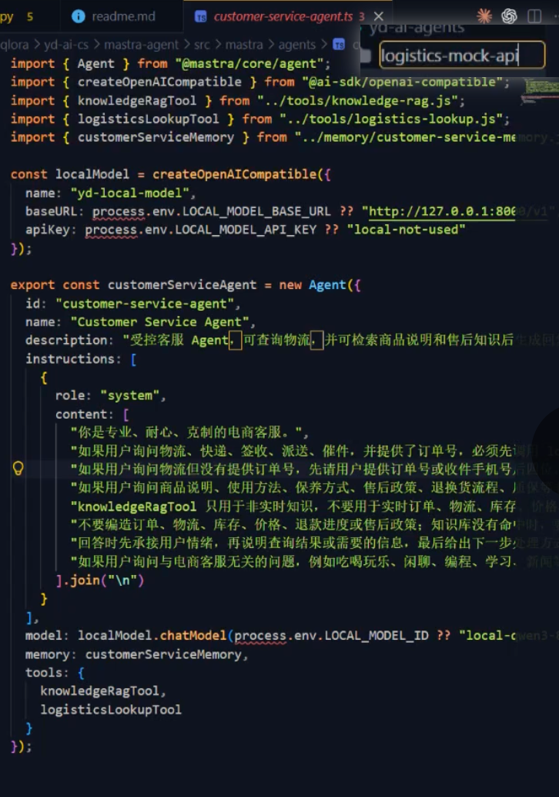

mastra主应用，调用其他应用服务的

依赖本地的http-demo作为模型服务


## 实现说明

- `src/mastra/agents/customer-service-agent.ts`：客服 Agent，system prompt 与 QLoRA 训练、
  `customer-http-demo` 保持同一套规则，通过 `createOpenAICompatible` 接到本地的
  `customer-http-demo`。
- `src/mastra/tools/knowledge-rag.ts`：RAG 工具，使用 Qwen embedding 生成查询向量，并从 Qdrant
  检索 `rag-knowledge/*.md` 入库后的维修知识片段。
- `src/mastra/tools/logistics-lookup.ts`：物流查询工具，真实实现，通过 HTTP 调用
  `customer-logistics-api`（尚未实现，先约定了 `GET /orders/{orderId}/logistics` 契约）。
- `src/mastra/memory/customer-service-memory.ts`：会话记忆，保留最近 20 轮。
- `src/mastra/index.ts`：注册 Mastra 实例（agent + LibSQL 本地存储）。

## 运行

依赖 `customer-http-demo` 已经在 `http://127.0.0.1:8123` 跑起来（提供 `/v1/chat/completions`
兼容接口）。

```bash
cd customer-agents
npm install

# 直接跑一个端到端测试脚本（走 Mastra 实例 + 本地存储，不需要 mastra dev）
npx tsx src/scripts/test-agent.ts

# 或者用 Mastra 自带的开发服务器/Studio
npx mastra dev
```

已端到端验证：物流未提供订单号（引导给订单号）、离题问题（礼貌拒答）两类场景，Agent 通过
OpenAI 兼容接口正确调用到本地模型并拿到符合模板的回复。

## RAG 准备

向量数据库使用 Qdrant，默认地址：

```text
http://127.0.0.1:6333
```

本机开发推荐的 Qwen 向量模型：

```text
Qwen/Qwen3-Embedding-0.6B
```

原因：0.6B 模型默认 1024 维，适合本机开发和小型维修知识库测试；4B 可以作为效果升级版，
8B 更适合服务器侧高质量检索，不建议作为本机默认。

启动 Qdrant：

```bash
docker compose -f ../docker-compose.qdrant.yml up -d
```

启动 Qwen embedding 服务时，建议用 OpenAI-compatible 或 TEI 风格 HTTP 服务。本项目默认按
TEI 的 `/embed` 接口调用：

```text
EMBEDDING_PROVIDER=tei
EMBEDDING_BASE_URL=http://127.0.0.1:8080
EMBEDDING_MODEL=Qwen/Qwen3-Embedding-0.6B
QDRANT_VECTOR_SIZE=1024
```

如果 embedding 服务提供 OpenAI-compatible `/v1/embeddings`，改成：

```text
EMBEDDING_PROVIDER=openai-compatible
EMBEDDING_BASE_URL=http://127.0.0.1:8080
EMBEDDING_MODEL=Qwen/Qwen3-Embedding-0.6B
```

维修知识入库：

```bash
cd customer-agents
npm run rag:ingest
```

入库脚本会读取：

```text
../rag-knowledge/*.md
```

并写入 Qdrant collection：

```text
customer_service_repair_knowledge
```
