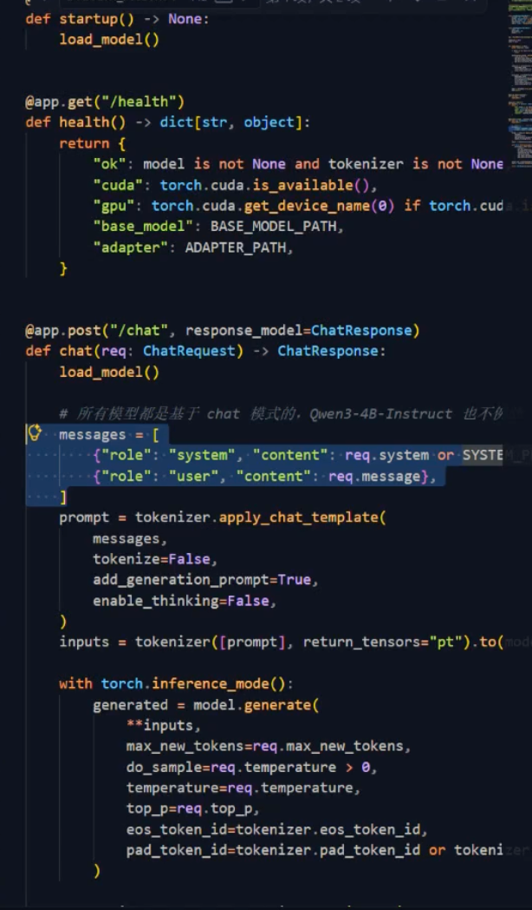
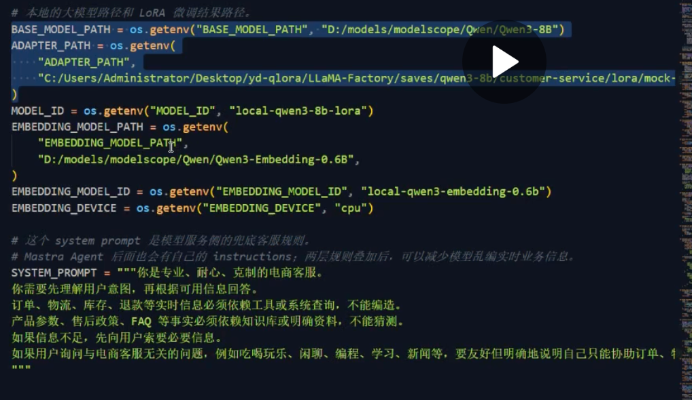

使用fast-api+pytorch进行qlora接口封装

大概逻辑



## 实现说明

已按上面的思路实现（基座模型 + LoRA adapter，用 transformers + peft 加载，FastAPI 包一层
`/health` + `/chat` 接口）。默认路径指向本项目里已经下载/训练好的产物：

- `BASE_MODEL_PATH` 默认：`customer-service-qlora/_local_infer/models/Qwen3-8B`
- `ADAPTER_PATH` 默认：`customer-service-qlora/saves/qwen3-8b-qlora-sft-v1-bf16`

都可以用同名环境变量覆盖。设备自动探测（cuda > mps > cpu），本机 Apple Silicon 会用 mps。

## 运行

```bash
cd customer-http-demo
python3.11 -m venv venv
source venv/bin/activate
pip install -r requirements.txt

uvicorn main:app --host 127.0.0.1 --port 8123
```

## 接口

```bash
# 健康检查
curl http://127.0.0.1:8123/health

# 对话
curl -X POST http://127.0.0.1:8123/chat \
  -H "Content-Type: application/json" \
  -d '{"message": "我的快递到哪了？"}'
```

`ChatRequest` 字段：`message`（必填）、`system`（可选，覆盖默认 system prompt）、
`max_new_tokens`、`temperature`、`top_p`。`ChatResponse` 返回 `reply` 和 `model_id`。

已本地验证过 B（物流未提供订单号）、D（库存/价格/退款进度）、E（离题拒答）三类场景，
回复符合训练时的模板化话术。