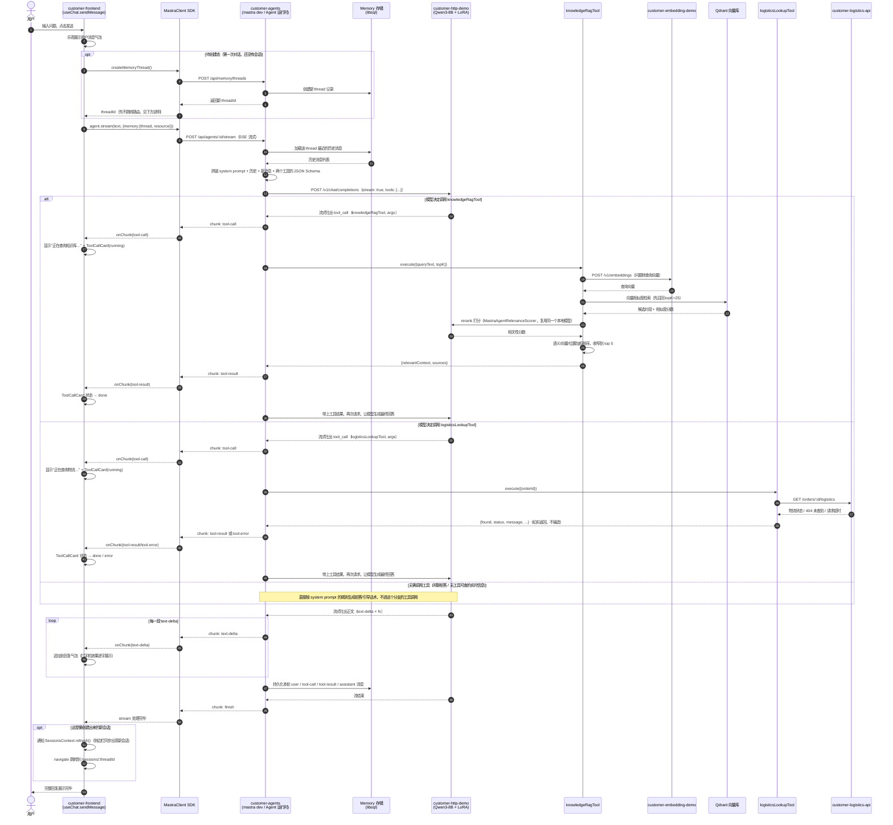

# 用户提问到回复：完整时序图

记录一次完整的用户问答，从 `customer-frontend`（浏览器）发出问题，到 `customer-agents`
（Mastra Agent 运行时）decide 是否调工具、真正拿到回复为止，涉及到的全部服务和调用顺序。

跟 [`Agent与LLM工具调用交互流程.md`](./Agent与LLM工具调用交互流程.md) 的关系：那份文档
聚焦在"Agent ↔ LLM ↔ 工具"这一段（从 Agent 已经拿到用户问题开始讲），核心结论是
**LLM 从不直接发起业务 API 请求，只负责"决策"和"组织话术"，真正的 HTTP 调用是 Agent 运行时
（TypeScript 代码）发起的**。这份文档把范围往前后各扩了一段：往前扩到浏览器里用户敲下问题、
前端怎么发起请求；往后扩到工具内部（`knowledgeRagTool`/`logisticsLookupTool`）具体做了什么。

## 涉及的服务

| 名字 | 是什么 | 默认端口 |
|---|---|---|
| `customer-frontend` | React 前端，playground 式聊天界面 | 5173 |
| `customer-agents`（`mastra dev`） | Mastra Agent 运行时，本文档的"大脑" | 4111 |
| `customer-http-demo` | 本地 Qwen3-8B + LoRA 模型服务 | 8123 |
| `customer-embedding-demo` | 本地 Embedding 模型服务 | 8080 |
| Qdrant | 向量数据库，存知识库 chunk | 6333 |
| `customer-logistics-api` | mock 的物流查询接口 | 8200 |
| Memory 存储（libsql） | 会话/消息持久化 | 内嵌在 `customer-agents` 里 |

## 完整时序图

## 几个容易忽略但很关键的点

1. **LLM 被调用了不止一次**：一轮问答如果命中了工具，LLM 实际上被请求了两次——第一次是"要不要
   调工具、调哪个、参数是什么"，第二次是"工具结果给你了，组织语言回答用户"。这两次都要走一遍
   `customer-http-demo` 的 `/v1/chat/completions`，是完整走网络的两次推理，不是一次推理里顺带
   查了个函数。

2. **RAG 的 rerank 也是一次 LLM 调用**：`knowledgeRagTool` 内部不是"检索完直接返回"，
   `MastraAgentRelevanceScorer` 精排这一步同样要请求本地模型打相关性分数。所以一次命中
   `knowledgeRagTool` 的问答，`customer-http-demo` 实际上被调用了三次（决策调工具 → rerank
   打分 → 最终组织回答），不是两次。

3. **懒创建会话时，路由跳转被推迟到整轮问答结束之后**：`createMemoryThread()` 成功后不会立刻
   跳转 URL，而是要等这一整轮（包括工具调用、拿到最终回复、消息落进本地状态）都完成了才跳转
   ——原因和踩过的坑记录在 [`customer-frontend/todo.md`](../customer-frontend/todo.md) 的
   "懒创建流程的竞态 bug" 一节：如果建完 thread 立刻跳转，路由切换会让当前展示这轮回复的组件
   被卸载重挂载，新实例这时候去拉历史消息会跟还没跑完的这轮对话竞态，大概率拉到空历史。

4. **前端从不直接跟 Embedding / Qdrant / 物流 API 打交道**：图里 `customer-embedding-demo`、
   Qdrant、`customer-logistics-api` 这几个服务，前端完全不知道它们的存在，全部是
   `customer-agents` 内部（准确说是两个工具的 `execute()` 函数里）发起的调用。前端只认识
   `customer-agents` 这一个后端。
