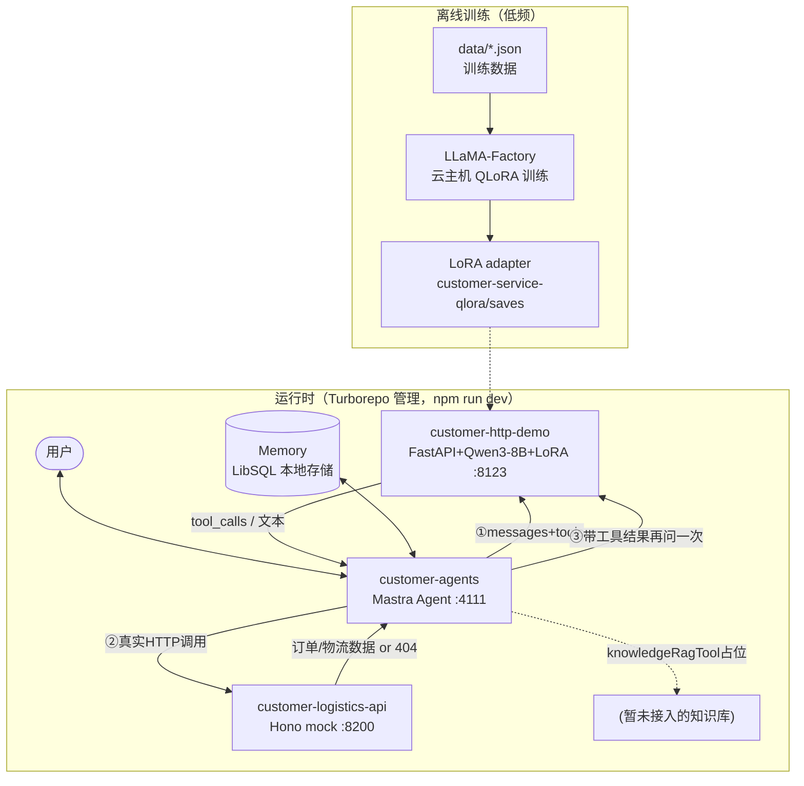

# 项目架构说明

给后续画流程图/架构图用的文字底稿。项目整体是一个电商智能客服 Demo：训练一个 QLoRA
微调过的 Qwen3-8B，包一层 HTTP 服务，接入 Mastra Agent 做工具调用编排，再对接（mock 的）
订单物流查询接口。

## 1. 组件总览

| 组件 | 目录 | 技术栈 | 端口 | 角色 |
|---|---|---|---|---|
| 训练产物 | `customer-service-qlora/` | Python / LLaMA-Factory | - | 不是运行时服务，产出 QLoRA adapter |
| 数据集 | `data/` | JSON | - | QLoRA 训练/评测用的数据 |
| 模型服务 | `customer-http-demo/` | Python / FastAPI + transformers + peft | 8123 | 加载基座模型+LoRA，提供 OpenAI 兼容 HTTP 接口 |
| 客服 Agent | `customer-agents/` | TypeScript / Mastra | 4111（Studio） | 决策要不要调用工具、组织最终回复 |
| mock 物流接口 | `customer-logistics-api/` | TypeScript / Hono | 8200 | 假的订单/物流查询数据源 |

根目录用 **Turborepo**（`turbo.json` + npm workspaces）统一管理 `customer-agents`、
`customer-http-demo`、`customer-logistics-api` 三个运行时服务的安装（`npm run setup`）
和启动（`npm run dev`，并发拉起三个服务，Ctrl+C/关闭终端一起停）。
`customer-service-qlora` 和 `data` 不是运行时服务，不在 workspace 里。

## 2. 离线训练链路（一次性/低频，产出模型文件）

```text
data/customer_service_zh_sft.json  ──┐
data/customer_service_zh_mock.json ──┤
                                      ▼
                       LLaMA-Factory（云主机 GPU）
                    Qwen3-8B + QLoRA(4bit NF4) 训练
                                      │
                                      ▼
              LoRA adapter（customer-service-qlora/saves/）
                    fp32 原始版 + 转换出的 bf16 版
                                      │
                                      ▼
        customer-http-demo/config.py 里的 ADAPTER_PATH 指向这份产物
```

- 基座模型：ModelScope 下载的 `Qwen/Qwen3-8B`，本机放在
  `customer-service-qlora/_local_infer/models/Qwen3-8B`。
- 训练数据只覆盖 system prompt 里"不涉及工具调用决策"的场景（物流未提供订单号 / 库存价格
  退款进度无工具可查 / 离题拒答），刻意不训练"该不该调用工具"这件事，交给基座模型的原生
  agentic 能力处理（详见 `task.md` 里的实测结论）。

## 3. 运行时请求链路（一次用户提问的完整路径）

```text
用户
  │
  ▼
customer-agents（Mastra Agent, Studio :4111 或 agent.generate()/stream()）
  │  ① 把 messages + tools schema 发给模型服务
  ▼
customer-http-demo（FastAPI :8123，/v1/chat/completions）
  │  用 transformers + peft 加载 Qwen3-8B + LoRA，套 chat_template（含 tools 定义）
  │  模型输出：要么是普通文本，要么是 <tool_call>{...}</tool_call>
  ▼
customer-agents 拿到响应
  │  如果是 tool_calls → ② 自己执行工具（不经过模型）
  ▼
logisticsLookupTool.execute()  ──HTTP──▶  customer-logistics-api（Hono :8200）
  │                                         GET /orders/:id/logistics
  │  ◀── 真实（mock）数据 或 404 ──────────────┘
  ▼
customer-agents 把工具结果拼回对话
  │  ③ 再发一次请求给模型服务，让它基于工具结果组织自然语言回复
  ▼
customer-http-demo（同一个 /v1/chat/completions，这次 finish_reason: stop）
  ▼
customer-agents 返回最终回复给用户
```

细节（每一步谁发起、参数怎么传、失败怎么处理）见
`docs/Agent与LLM工具调用交互流程.md`。

knowledgeRagTool 走的是类似路径，但目前是占位实现（`customer-agents/src/mastra/tools/
knowledge-rag.ts`），恒定返回"未命中"，不接真实知识库。

## 4. 多轮对话记忆

```text
customer-agents/src/mastra/memory/customer-service-memory.ts
      Memory({ lastMessages: 20 })
              │
              ▼
customer-agents/src/mastra/index.ts
      Mastra({ storage: LibSQLStore(本地 sqlite 文件) })
```

调用方（Studio 界面自动管理，脚本调用需要手动传）提供 `{ resource, thread }`，Mastra
据此存取历史消息，自动拼进每次发给模型服务的 `messages` 里。LLM 本身无状态，"记得上文"
是 Mastra Memory 重新拼接上下文的结果，不是模型自己在维护状态。

## 5. 关键配置对应关系

| 配置项 | 位置 | 作用 |
|---|---|---|
| `SYSTEM_PROMPT` | `customer-http-demo/config.py` | 模型服务侧兜底 system prompt，措辞必须和下面两处保持完全一致的祈使句式 |
| Agent `instructions` | `customer-agents/src/mastra/agents/customer-service-agent.ts` | Mastra Agent 真正下发给模型的 system prompt |
| 生产 system prompt 原文 | `docs/task.md` 0 节 | 三处的"唯一真源"，改一处要三处一起改 |
| `LOCAL_MODEL_BASE_URL` | `customer-agents` 环境变量 | 指向 customer-http-demo，默认 `http://127.0.0.1:8123/v1` |
| `LOGISTICS_API_BASE_URL` | `customer-agents` 环境变量 | 指向 customer-logistics-api，默认 `http://127.0.0.1:8200` |
| `BASE_MODEL_PATH` / `ADAPTER_PATH` | `customer-http-demo` 环境变量 | 基座模型和 LoRA adapter 的本地路径 |

## 6. 组件关系图（Mermaid，可直接渲染或作为画图起点）


