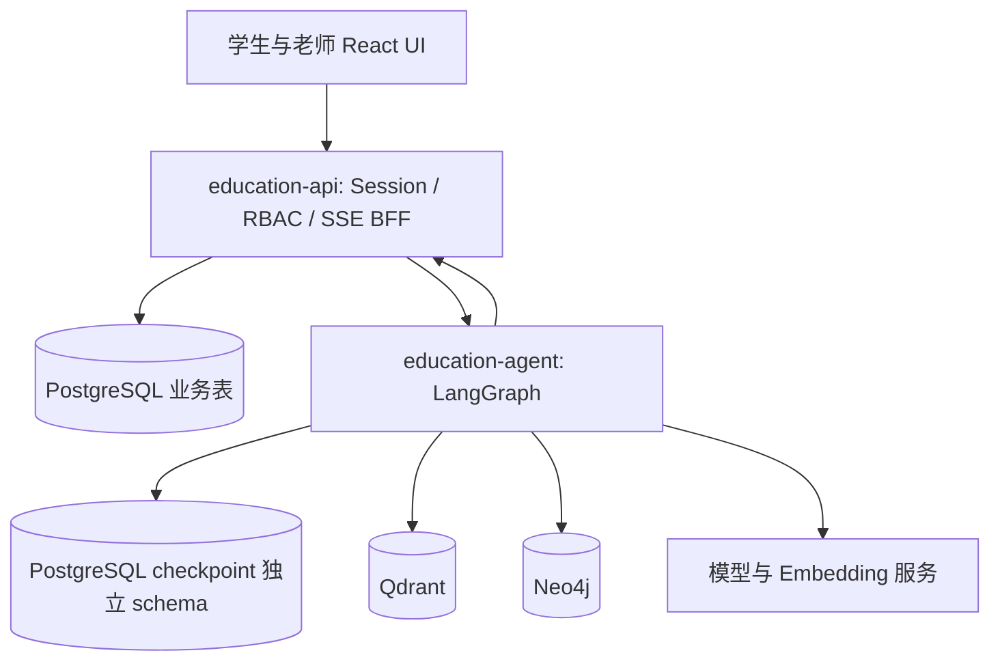

# 技术设计与接口契约

## 1. 仓库现状

架构：npm workspaces + Turborepo monorepo，前后端分离，Python 模型服务。
已有 customer-frontend（React/Vite）、customer-agents（Mastra）、customer-logistics-api（Hono mock）、customer-http-demo（本地推理）、customer-embedding-demo、customer-qdrant、customer-service-qlora。
现有前端依赖 @mastra/client-js；不能只替换后端而忽略会话与流式协议。
检查时没有 .codex/CODEX.md、.codex/rules 或已有 specs；遵循用户提供的复杂度、深模块和设计两次原则。

## 2. 模块规划

| 路径 | 责任 |
|---|---|
| customer-frontend/ | 复用 UI，增加学生/老师页面；普通 HTTP/SSE 适配器替代对 Mastra 的直接依赖 |
| education-api/（新增，TS/Hono） | 认证、业务数据库、申请事务、内容发布、回放授权；对浏览器唯一入口/BFF |
| education-agent/（新增，Python/FastAPI/LangGraph） | 私有 Agent 服务、checkpoint、RAG 与图谱工具、评估入口 |
| contracts/education/（新增） | OpenAPI、流式事件 schema、版本说明；生成 TS/Python 类型或做契约验证 |
| infra/education/（新增） | PostgreSQL/Neo4j/Qdrant 的开发 Compose 与环境示例 |
| data/education/（新增） | 合成 seed、字幕、图谱审核样例；不放真实私人数据 |
| evals/education/（新增） | 固定数据集、断言、实验配置及报告说明 |
| customer-service-qlora/ | 保留旧训练，新增教育实验配置、数据来源说明 |
| customer-agents/、customer-logistics-api/ | 保留原型用于基线；新默认启动不依赖旧链路 |

保留 Hono 服务技术与有用代码，新建教育模块避免旧电商名称污染；不同时重写所有服务。实现时锁定稳定兼容版本，查阅对应官方文档，不照抄未经验证的新 API。

## 3. 运行与信任边界

- 浏览器不直连 Python、Neo4j、Qdrant 或模型。
- BFF 校验 session/资源后签发短时内部上下文（actorId、role、requestId、有效期），Python 校验签名/服务身份；不能信任浏览器提交的 actor。
- Python 回调业务工具需内部认证和代理身份，业务 API 再次验证资源权限。内部 token 不进入模型提示词。
- 服务端会话使用 HttpOnly cookie，同源部署；写请求做 Origin/CSRF 防护。演示密码使用可靠 hash，seed 密码仅开发环境可用。
- 私人检索先从 API 取得有效 cohort/content 范围，在向量/图查询中加筛选；最终引用再次核验。
- 工具只用 allowlist、参数化 SQL/Cypher，服务端限制 topK、图深度、超时和总调用次数。

## 4. 数据模型（字段为最低要求）

全部实体使用稳定 UUID、createdAt/updatedAt；关键可变记录有 revision。外键、索引、唯一约束写入 migration。

| 表 | 核心字段及约束 |
|---|---|
| users / sessions | email/loginName unique、passwordHash、role student/teacher；session 过期/注销 |
| courses | title、archived |
| course_versions | courseId、version、outline、publishedAt；发布后新版本替代而非覆盖旧权益 |
| policies | version、text、publishedAt；历史订单引用不可被删除 |
| cohorts | courseId、courseVersionId、name、startAt nullable、priceCents nullable、currency、isCurrentSale、status；课程最多一个 current sale |
| orders | studentId、cohortId、policyId、paidCents、refundedCents、source seed/manual；金额非负 |
| enrollments | studentId、orderId、cohortId、status、revision |
| enrollment_changes | enrollmentId、from/toCohortId、applicationId unique、teacherId |
| replay_entitlements | studentId、cohortId、sourceApplicationId/orderId、revokedAt nullable；授权查询不只依赖当前报名 |
| lessons / replay_segments | cohortId、title、order、replayAssetKey；segment sourceId/version/start/end/text |
| learning_progress | studentId、lessonId unique pair、status、source manual/import；不记为知识掌握 |
| applications | studentId、enrollmentId、type、reason、targetCohortId nullable、status、executionStatus、proposal json、revision、confirmedRevision |
| application_events | applicationId、actorId、eventType、revision、details；追加式审计 |
| confirmations | userId、applicationId、payloadHash、revision、expiresAt、usedAt；绑定内容，不把 token 暴露给 LLM |
| idempotency_records | actorId、operation、key unique triple、requestHash、resultId；不同 payload 同 key 拒绝 |
| conversations / messages | ownerId、mode、messageId unique per conversation、role、content、runId |
| handoffs | conversationId、status、teacherId nullable、summary、reason |
| knowledge_sources | type public/private、cohortId nullable、activeVersion、status、assetKey |
| knowledge_revisions / concept_relations | 来源版本、片段和关系的编辑审核事实；用于重建投影 |
| index_jobs / outbox_events | jobType、sourceVersion、status、attempts、lastError；可重试与去重 |

审批状态：draft → submitted → needs_info / awaiting_student_confirmation → submitted → approved / rejected；未批准的已提交申请可 withdrawn。draft 可删除/过期。
执行状态：not_started / pending / completed / failed，仅 approved 后执行。转班事务成功时 approved+completed；退款批准为 approved+pending。
部分唯一索引限制同 enrollment/type 的非终态申请；幂等键解决请求重试，唯一索引解决不同 key 重复申请。

### 原子性与重放

- 转班批准事务：锁申请/报名 → 校验 revision 与 confirmedRevision → 验证目标 → 更新报名及权益 → 追加审批和历史 → 写 outbox → 提交。
- 退款登记事务锁订单，校验剩余可退额；重复登记不得重复增加 refundedCents。
- 外部没有支付执行器，因此不实现资金转账；登记结果保留来源和操作人。
- checkpoint 恢复可能重执行节点，节点调用幂等业务 API；不得在 interrupt 之前做不可幂等写入。
- 业务变更与 outbox 同事务；通知任务可重复投递。首版 Agent 在新消息/恢复时回查 API，以业务状态为准。

## 5. HTTP API 契约

前缀 /api/v1。JSON 使用 camelCase；金额整数分；日期 ISO8601 UTC。
错误统一为 `{error:{code,message,requestId,details?}}`；不向学生返回内部栈。
状态码：401 未登录、403 无角色权限、404 不存在/他人私人资源、409 状态或版本冲突、422 参数错误、429 预算限制、503 依赖不可用。
写操作接受 Idempotency-Key；状态更新携带 expectedRevision。所有 studentId 都由服务端取得。

| 方法与路径 | 请求/响应核心 | 权限 |
|---|---|---|
| POST /auth/login | loginName,password → session cookie,user | public |
| POST /auth/logout；GET /me | 注销；身份 | login |
| GET /catalog/current | cohortId,title,version,startAt,priceCents,currency,publicFacts | public |
| GET /me/enrollments | enrollmentId,cohort,rights,policyVersion | student |
| GET /me/enrollments/:id/schedule；/progress | lessons 或 progress，标注来源 | owner |
| GET /cohorts/transfer-targets?enrollmentId= | 可展示的已建立目标；不承诺批准 | owner |
| POST /applications/drafts | type,enrollmentId,reason,targetCohortId? → id,revision,summary,confirmation | owner |
| PATCH /applications/:id/draft | 修改字段,expectedRevision → 新摘要/confirmation | owner |
| POST /applications/:id/confirm | confirmationId,expectedRevision → submitted | owner，仅可信 UI |
| GET /me/applications；GET /applications/:id | 列表/详情/事件 | owner or teacher |
| POST /applications/:id/supplement | text,expectedRevision → submitted | owner |
| POST /applications/:id/withdraw | expectedRevision → withdrawn | owner |
| POST /applications/:id/proposal-response | accept:boolean,confirmationId,expectedRevision | owner |
| GET /teacher/applications | status/type 分页过滤 | teacher |
| POST /teacher/applications/:id/request-info | question,expectedRevision → needs_info | teacher |
| POST /teacher/applications/:id/propose | targetCohortId? / refundCents?,reason,expectedRevision → awaiting_student_confirmation | teacher |
| POST /teacher/applications/:id/approve | expectedRevision,oldReplayAccess:keep/revoke（转班必填） | teacher |
| POST /teacher/applications/:id/reject | reason,expectedRevision | teacher |
| POST /teacher/applications/:id/refund-result | outcome,reference?,note,expectedRevision；人工登记 | teacher |
| GET /replays/:segmentId/access | 授权后返回受控播放入口/短期地址和时间范围 | entitled |
| POST /conversations；GET /conversations | 创建/本人列表，访客使用受限临时会话 | session |
| GET /conversations/:id/messages | 已存消息和任务状态 | owner/assigned teacher |
| POST /conversations/:id/messages | clientMessageId,text → SSE | owner |
| POST /conversations/:id/handoff | reason? → queue status | owner |
| POST /teacher/handoffs/:id/claim；/release | expectedRevision | teacher |
| POST /teacher/conversations/:id/messages | clientMessageId,text | assigned teacher |

老师内容 CRUD：/teacher/cohorts、/teacher/lessons、/teacher/enrollments、/teacher/progress/import、/teacher/knowledge/sources、/teacher/knowledge/relations；统一分页/校验/revision。文档/关系发布和撤回提供独立 POST /:id/publish、/:id/unpublish。上传限大小与格式，禁止任意 URL 抓取。
所有以上端点在 T-02 输出可校验 OpenAPI；契约版本变更更新消费方，不复制 TS/Python 两套漂移模型。

### 流式事件

SSE 是 POST fetch 流，不依赖浏览器原生 EventSource 的 GET 限制。每个事件：`{eventId,conversationId,runId,type,payload}`。
类型：message.delta、tool.status（脱敏）、citation、replay.card、application.confirmation、handoff.status、message.completed、run.error。
completed 含完整 assistant messageId/text 以便客户端核对。持久化消息与申请，断线后 GET 最新消息/状态恢复；V1 不承诺每个 token 重放。
用户点击确认使用普通业务 POST；BFF 写会话事件并安排 Agent 读取最新事实，不把“确认”文本当成授权。并发消息返回 409 RUN_IN_PROGRESS 或显式排队，首版选择 409。

## 6. Agent 与检索实现

图流程：load_authorized_context → route → direct_query / knowledge / replay_navigation / application_draft / handoff → respond。
需要确认时持久化 confirmation 引用并 interrupt；恢复前重新校验权限和申请版本。
不要求每个节点调用 LLM；身份、权限、状态更新、金额校验都是代码。

工具：getCurrentOffering、getMyEnrollment、getMySchedule、getMyProgress、searchKnowledge、findReplaySegments、getPrerequisiteLessons、getTransferTargets、prepareApplication、getApplicationStatus、requestHandoff。
禁止提供 approveApplication、executeRefund、任意 SQL/Cypher 或任意网络执行工具给学生 Agent。

图谱是知识投影，不是业务事实源。Neo4j 标签与关系对应 requirements F-008；所有节点有稳定业务 ID/sourceVersion。
Qdrant payload 必含 sourceId、sourceVersion、cohortId、visibility、lessonId、segmentId。查询范围必须显式生成，空权限不能退化为查询所有数据。
资料发布采用版本化投影：构建新版本索引 → 检查完成 → 激活版本；查询校验业务 activeVersion，未激活或撤回片段不可返回。清理旧索引异步重试，不能等待清理才撤销访问。
首版模型辅助抽取可离线导入审核 JSON，不必先做自动抽取平台。
图不可用降级普通 RAG；向量检索不可用则报告无法查证，不以模型记忆替代受限资料。

## 7. 测试与实验

- 单元：状态机、金额、幂等、关系循环、字幕时间解析。
- 集成：真实开发 PostgreSQL 上的并发审批/事务；Qdrant/Neo4j 的权限和版本过滤；BFF→Agent 契约。
- E2E：登录学生提交，老师处理，学生查询；回放导航；接管；重启恢复。
- Agent mock tests 验证编排，不能作为模型质量证据。
- 模型评估：记录 dataset hash、seed/采样配置、model/adapter、prompt、tool schema、index version 和硬件。
- 初始至少 60 条可核验案例，最终建议 120～200 条，其中保留独立测试集；数量是计划，不保证统计代表性。
- RAG 与 RAG+图谱在同来源集比较直接定位、先修查询、无覆盖；记录正确率、引用有效性、延迟。
- 所有 AC 的确定性检查必须通过；质量改进如未成立照实报告，不以任意分数包装成功。

## 8. 设计决策

| 决策 | 备选 | 选择原因 |
|---|---|---|
| Python LangGraph 编排 | 继续 Mastra | 用户面试学习方向；先验证再切换，保留原型回滚 |
| TS 业务 API + Python Agent | 全 Python 重写 | 复用 Web 技能，领域事务与模型执行边界明确 |
| Neo4j 课程关系 | 仅关系表 | 用户明确学习目标；范围限制在先修/片段，不扩成全业务图谱 |
| 申请规则人工处理 | 自动规则引擎 | 实际业务没有明确公式，不编造政策 |
| UI 确认提交 | 自然语言直接执行 | 绑定确切内容、身份及版本，可审计和验证 |
| 数据库任务/outbox | Redis+消息中间件 | 当前规模不需要多一套基础设施，保证失败可重试 |

官方实施参考（实施时再次核对锁定版本）：
- https://docs.langchain.com/oss/python/langgraph/persistence
- https://docs.langchain.com/oss/python/langgraph/interrupts
- https://qdrant.tech/documentation/search/hybrid-queries/
- https://neo4j.com/docs/cypher-manual/current/

## 9. 迁移与交付边界

旧 Mastra 会话不自动搬迁，旧原型保留可访问说明；新应用用新会话表。保留原数据和用户未提交修改。
开发命令显式区分 legacy、education-mock、education-real，不自动启动所有旧服务和大模型。
本地交付默认 Docker 数据服务+业务 API+Agent+UI；云训练配置和真实模型验证单列。没有云授权/模型/真实资料时只将对应任务标记待条件，不能把整项完成或制造测量结果。

## 10. 学习证据与复盘

核心模块同时提供调用路径、正常与失败复现方法及一个备选方案的取舍。学习验收见 learning-plan.md，仅写概念文档不能替代实验。基础追踪从 M3 接入，评估从 M0 累积；M6 分别验收微调、稳定性和面试交付。
RAG 至少比较纯向量与现有重排的效果/耗时，解释 Recall@K 与回答正确性的区别；图谱实验保持同资料和权限范围；微调实验保持工具和检索配置一致。无收益时保留真实结论。
